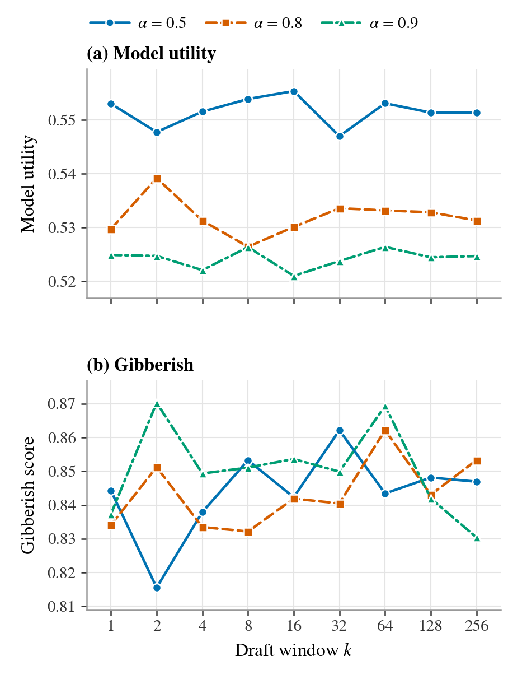
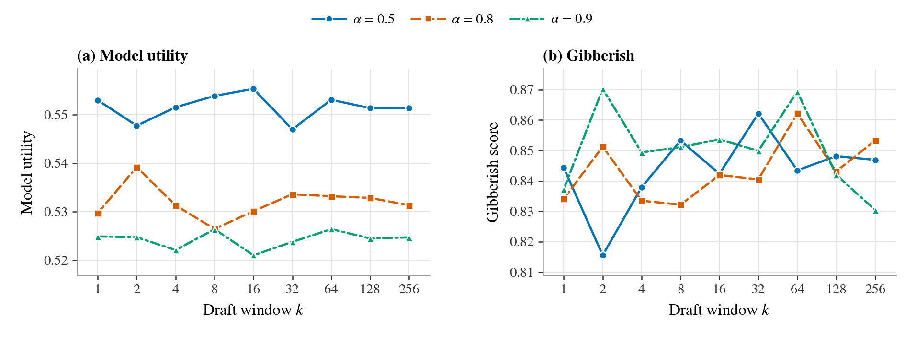
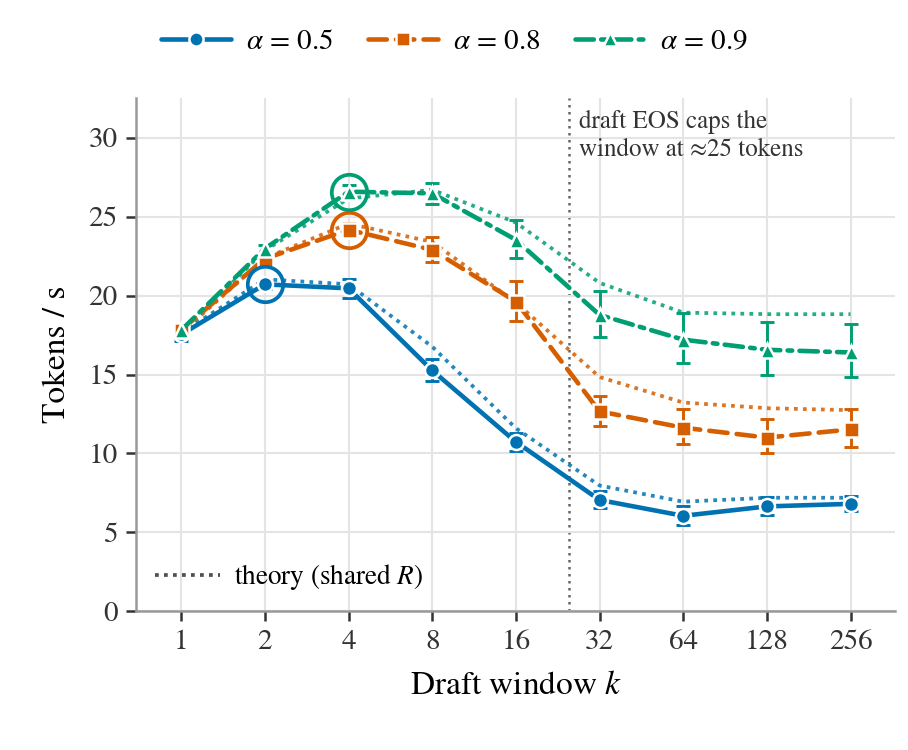

# k-sweep figures for SUD (NPO draft) — model utility and gibberish (invariance) and throughput vs the draft window k

_Generated 2026-09-09T14:06 by `plots/make_figure.py --method NPO`. Everything for these figures lives in `plots/`._

**Figure 1 — invariance** (`fig_k_invariance.pdf`, one ACL column; `fig_k_invariance_wide.pdf`, full text width):

**Figure 2 — throughput** (`fig_k_throughput.pdf`, one ACL column):

## Suggested captions

**Figure 1. The draft window k does not change SUD's output.** TOFU forget10, target p = Llama-3.2-1B-Instruct fine-tuned on TOFU, draft q = its NPO-unlearned checkpoint, seed 0 at every k. (a) Model utility and (b) gibberish score (classifier P(clean) of the forget answers; higher = fewer gibberish answers) are flat in k for every α: SUD samples each token exactly from π ∝ p^(1−α) q^α by draft-verify speculative sampling with no bonus token, so k only sets how many tokens are proposed per round. Seed-to-seed SD at k = 1 is 0.002–0.003 (utility) and 0.007–0.011 (gibberish).

**Figure 2. What k buys in speed.** Throughput of the same cell on 100 forget prompts (batch 1, no KV cache; error bars: bootstrap 95% CI over prompts; rings mark each α's fastest k). Dotted: T(k) = R(1−a^k̃)/((1−a)(k̃+1)) with one shared forward rate R, per-α acceptance a, and k̃ the measured mean drafted tokens per round, which saturates once the draft reaches its own end-of-sequence before k. Best measured speed-up over k = 1: 1.49× at α = 0.9, k = 4.

## Status

- Panels (a)/(b) eval runs: **27/27** sweep points (seed 0) under `plots/results/original-unlearned/target-Llama-3.2-1B-Instruct/draft-Llama-3.2-1B-Instruct_NPO/`; 9/9 extra k=1 seed runs (seeds [1, 2, 3]) available as the noise yardstick.
- Figure 2 benchmark cells: **27/27** from `plots/bench/spec_bench.json` (`TOFU_EVAL.json` prompts, n=100, max_new_tokens=200, GPU: NVIDIA RTX A6000)
- Reference lines (target / draft / retain): **not drawn** (default; pass `--with-baselines` to add them); values from `plots/baselines.json` (target p (original), retain model, draft q (NPO)).

## Conference styling (EMNLP / ACL)

- Sizes: `fig_k_invariance.pdf` is one ACL column (3.03 in) with (a) above (b) on a shared k-axis, `fig_k_invariance_wide.pdf` the full text width (6.3 in) side by side; `fig_k_throughput.pdf` is one column. Text 7–8 pt at print size.
- Colour: Okabe–Ito colour-blind-safe palette (blue #0072B2, vermillion #D55E00, bluish green #009E73). Every α also has its own dash pattern (solid / dashed / dash-dot) and marker (circle / square / triangle), so the series stay apart under any colour-vision deficiency and in greyscale print; the theory is dotted; optional reference lines are grey-scale with distinct patterns.
- Fonts: STIX / Times-like serif to match the ACL body text; embedded as TrueType (`pdf.fonttype = 42`), never Type 3, so the PDF passes ACL's pubcheck. No subtitles inside the figure — see the suggested caption.

## Setup

- Cell: target p = `open-unlearning/tofu_Llama-3.2-1B-Instruct_full`, draft q = `saves/unlearn/baselines/tofu/NPO/Llama-3.2-1B-Instruct/forget10` (NPO), TOFU forget10 eval suite.
- SUD decodes from π = softmax((1−α)·log p + α·log q) by draft-verify speculative sampling (`src/model/sud.py`): the draft proposes up to k tokens from q, one target forward verifies them, each is accepted w.p. min(1, π/q), the first rejection is replaced by a residual sample and ends the round. No bonus token (it would follow p and leak forget content). k therefore never changes the sampled distribution — Figure 1 is the empirical check; Figure 2 is what k buys in speed.
- Grid: α ∈ {0.5, 0.8, 0.9} × k ∈ {1, 2, 4, 8, 16, 32, 64, 128, 256}, seed 0. Noise yardstick: seeds [0, 1, 2, 3] at k = 1 (SD reported, no band drawn).
- The eval generates at most 200 new tokens, so a window k > 200 is clipped to the remaining budget each round; and the draft stops proposing at its own EOS, so for k beyond the draft's typical answer length (~35 tokens) the effective window no longer grows with k — k = 64, 128, 256 are then near-identical procedures (only the random draws differ).
- Figure 2: 100 prompts = the first 100 `forget_Q_A_ROUGE` inputs of a Part-1 TOFU_EVAL.json, rebuilt token-for-token through the eval's own dataset/collator path and asserted to decode to the stored `input` strings; batch size 1; eval generation config (max_new_tokens = 200, temperature 1); wall-clock around `generate`, CUDA-synchronised; no KV cache (the prototype re-runs full forwards). Error bars: bootstrap 95% CI (4000 resamples of the prompt set, ratio of total tokens to total seconds).

## Reference values (panels a/b) — not drawn by default; `--with-baselines` adds them

| line | model | role | model_utility | forget_Q_A_gibberish | gibberish source |
|---|---|---|---|---|---|
| target p (original) | `open-unlearning/tofu_Llama-3.2-1B-Instruct_full` | alpha = 0 limit | 0.5992 | 0.8606 | recomputed from stored forget_Q_A_ROUGE generations |
| retain model | `open-unlearning/tofu_Llama-3.2-1B-Instruct_retain90` | TOFU gold reference (retrained without forget10) | 0.5911 | 0.9043 | recomputed from stored forget_Q_A_ROUGE generations |
| draft q (NPO) | `saves/unlearn/baselines/tofu/NPO/Llama-3.2-1B-Instruct/forget10` | alpha = 1 limit | 0.5463 | 0.9299 | recomputed from stored forget_Q_A_ROUGE generations (stored 0.9299, abs diff 0.0000) |

- These are the standard **greedy-decoded** evals (`do_sample: false`) on byte-identical prompts; SUD always samples at T = 1, which by itself costs about 0.015 model_utility relative to greedy decoding (measured on the main grid as the median generate-minus-forward gap: +0.022 sampled vs +0.037 greedy). Read the SUD-vs-reference gap with that in mind; the k-invariance claim does not depend on it. Where the metric was not stored (target, retain) it was recomputed from the stored generations with the exact metric config; the draft's recomputation reproduces its stored value (see the abs diff column).

## Panel (a) — model_utility across k

| α | k=1 | k=2 | k=4 | k=8 | k=16 | k=32 | k=64 | k=128 | k=256 |
|---|---|---|---|---|---|---|---|---|---|
| 0.5 | 0.5530 | 0.5478 | 0.5516 | 0.5539 | 0.5554 | 0.5470 | 0.5531 | 0.5514 | 0.5514 |
| 0.8 | 0.5297 | 0.5392 | 0.5313 | 0.5265 | 0.5301 | 0.5336 | 0.5332 | 0.5329 | 0.5313 |
| 0.9 | 0.5249 | 0.5247 | 0.5221 | 0.5264 | 0.5210 | 0.5238 | 0.5264 | 0.5245 | 0.5247 |

| α | max abs Δ vs k=1 | range over k | slope / doubling of k | seeds at k=1 | seed SD (k=1) | max abs z vs seeds |
|---|---|---|---|---|---|---|
| 0.5 | 0.0060 | 0.0084 | +0.00001 | 4 | 0.0020 | 2.35 |
| 0.8 | 0.0094 | 0.0127 | -0.00003 | 4 | 0.0031 | 3.56 |
| 0.9 | 0.0039 | 0.0054 | +0.00007 | 4 | 0.0020 | 1.40 |

- z = (value at k − mean over seeds at k=1) / seed SD; abs z ≲ 2–3 is indistinguishable from seed noise. The slope is a least-squares trend in log2 k; a k effect would show as a slope ≫ seed SD. α=0.5: max abs z = 2.35, slope +0.00001 per doubling of k vs seed SD 0.0020; α=0.8: max abs z = 3.56, slope -0.00003 per doubling of k vs seed SD 0.0031; α=0.9: max abs z = 1.40, slope +0.00007 per doubling of k vs seed SD 0.0020.
- Reference values (greedy-decoded standard evals, same prompts; not drawn by default): target p (original) = 0.5992, retain model = 0.5911, draft q (NPO) = 0.5463.

## Panel (b) — forget_Q_A_gibberish across k

| α | k=1 | k=2 | k=4 | k=8 | k=16 | k=32 | k=64 | k=128 | k=256 |
|---|---|---|---|---|---|---|---|---|---|
| 0.5 | 0.8443 | 0.8156 | 0.8379 | 0.8533 | 0.8423 | 0.8622 | 0.8434 | 0.8482 | 0.8469 |
| 0.8 | 0.8341 | 0.8513 | 0.8335 | 0.8322 | 0.8419 | 0.8405 | 0.8622 | 0.8431 | 0.8533 |
| 0.9 | 0.8373 | 0.8703 | 0.8494 | 0.8511 | 0.8536 | 0.8499 | 0.8694 | 0.8420 | 0.8304 |

| α | max abs Δ vs k=1 | range over k | slope / doubling of k | seeds at k=1 | seed SD (k=1) | max abs z vs seeds |
|---|---|---|---|---|---|---|
| 0.5 | 0.0287 | 0.0466 | +0.00214 | 4 | 0.0114 | 2.11 |
| 0.8 | 0.0281 | 0.0301 | +0.00197 | 4 | 0.0114 | 2.01 |
| 0.9 | 0.0330 | 0.0399 | -0.00123 | 4 | 0.0069 | 5.42 |

- z = (value at k − mean over seeds at k=1) / seed SD; abs z ≲ 2–3 is indistinguishable from seed noise. The slope is a least-squares trend in log2 k; a k effect would show as a slope ≫ seed SD. α=0.5: max abs z = 2.11, slope +0.00214 per doubling of k vs seed SD 0.0114; α=0.8: max abs z = 2.01, slope +0.00197 per doubling of k vs seed SD 0.0114; α=0.9: max abs z = 5.42, slope -0.00123 per doubling of k vs seed SD 0.0069.
- Reference values (greedy-decoded standard evals, same prompts; not drawn by default): target p (original) = 0.8606, retain model = 0.9043, draft q (NPO) = 0.9299.

## Figure 2 — throughput, acceptance, forward rate, VRAM vs k

**Tokens / s** (measured; bootstrap 95% CI over prompts):

| α | k=1 | k=2 | k=4 | k=8 | k=16 | k=32 | k=64 | k=128 | k=256 |
|---|---|---|---|---|---|---|---|---|---|
| 0.5 | 17.54 [17.1, 17.9] | 20.72 [20.4, 21.0] | 20.46 [19.9, 21.1] | 15.26 [14.6, 16.0] | 10.74 [10.2, 11.3] | 7.05 [6.6, 7.6] | 6.05 [5.5, 6.7] | 6.64 [6.1, 7.2] | 6.81 [6.4, 7.3] |
| 0.8 | 17.82 [17.7, 18.0] | 22.34 [22.1, 22.6] | 24.17 [23.8, 24.6] | 22.90 [22.1, 23.7] | 19.63 [18.4, 20.9] | 12.67 [11.8, 13.6] | 11.63 [10.6, 12.8] | 11.00 [10.0, 12.2] | 11.52 [10.4, 12.8] |
| 0.9 | 17.81 [17.7, 17.9] | 22.98 [22.8, 23.2] | 26.59 [26.2, 27.0] | 26.48 [25.8, 27.1] | 23.54 [22.4, 24.8] | 18.78 [17.4, 20.3] | 17.21 [15.7, 18.9] | 16.57 [15.0, 18.3] | 16.40 [14.8, 18.2] |

**Speed-up vs k = 1** — measured wall-clock ratio, and in parentheses the exact algorithmic ratio 2 / (forwards per committed token), which is free of timing noise:

| α | k=1 | k=2 | k=4 | k=8 | k=16 | k=32 | k=64 | k=128 | k=256 | k* (meas.) | best (meas.) | k* (theory) | theory ceiling |
|---|---|---|---|---|---|---|---|---|---|---|---|---|---|
| 0.5 | 1.00× (1.00×) | 1.18× (1.19×) | 1.17× (1.16×) | 0.87× (0.86×) | 0.61× (0.61×) | 0.40× (0.40×) | 0.34× (0.37×) | 0.38× (0.38×) | 0.39× (0.38×) | 2 | 1.18× | 2 | 1.19× |
| 0.8 | 1.00× (1.00×) | 1.25× (1.27×) | 1.36× (1.37×) | 1.29× (1.30×) | 1.10× (1.11×) | 0.71× (0.73×) | 0.65× (0.63×) | 0.62× (0.62×) | 0.65× (0.66×) | 4 | 1.36× | 4 | 1.39× |
| 0.9 | 1.00× (1.00×) | 1.29× (1.29×) | 1.49× (1.50×) | 1.49× (1.50×) | 1.32× (1.34×) | 1.05× (1.07×) | 0.97× (0.92×) | 0.93× (0.93×) | 0.92× (0.93×) | 4 | 1.49× | 8 | 1.51× |

- **Best measured speed-up: 1.49× at (α = 0.9, k\* = 4)**. The ceiling for no-bonus speculative sampling with an equal-size draft is 2× over k = 1 (T(1) = R/2, sup_k T = R as a → 1).

**Theory** T(k) = R / F(k), F = predicted forwards per committed token = Σ_rounds (k_i+1) / Σ_rounds (1−a^k_i)/(1−a), i.e. the round-length DISTRIBUTION, not its mean (k_i ≤ k: the draft stops at its own EOS and at the generation budget; once rounds are heterogeneous, the closed form at the mean k̃ overstates throughput because long rounds burn forwards linearly while their accepted tokens saturate at 1/(1−a)). One shared R = median forwards/s over all cells (35.3 forwards/s; per-cell range 33.0–37.3, spread 12%); a = pooled acceptance per α. Round lengths per cell from: **prompts** = per-prompt mean lengths (cells benchmarked before the histogram was recorded; heterogeneity across prompts only). Tokens/s, measured / theory:

| α | k=1 | k=2 | k=4 | k=8 | k=16 | k=32 | k=64 | k=128 | k=256 | a | k̃ at largest k |
|---|---|---|---|---|---|---|---|---|---|---|---|
| 0.5 | 17.5 / 17.6 | 20.7 / 21.0 | 20.5 / 20.7 | 15.3 / 16.8 | 10.7 / 11.6 | 7.1 / 8.0 | 6.0 / 6.9 | 6.6 / 7.2 | 6.8 / 7.2 | 0.792 | 22.3 (k=256) |
| 0.8 | 17.8 / 17.6 | 22.3 / 22.4 | 24.2 / 24.6 | 22.9 / 23.4 | 19.6 / 19.6 | 12.7 / 14.8 | 11.6 / 13.2 | 11.0 / 12.9 | 11.5 / 12.7 | 0.909 | 25.9 (k=256) |
| 0.9 | 17.8 / 17.6 | 23.0 / 22.9 | 26.6 / 26.2 | 26.5 / 26.7 | 23.5 / 24.6 | 18.8 / 20.8 | 17.2 / 18.9 | 16.6 / 18.8 | 16.4 / 18.8 | 0.952 | 26.6 (k=256) |

- Theory vs measurement: mean abs relative error 6.8%, max 17.2% over 27 cells (the closed form at the mean k̃ would give 7.9% / 20.1%). Nothing is fitted: R is shared and a is the pooled acceptance, so the residual is hardware-rate fluctuation plus whatever round-length heterogeneity the available per-cell data cannot resolve (see the source note above).

  Signed relative error (theory − measured) / measured, per cell:

| α | k=1 | k=2 | k=4 | k=8 | k=16 | k=32 | k=64 | k=128 | k=256 |
|---|---|---|---|---|---|---|---|---|---|
| 0.5 | +0.6% | +1.5% | +1.3% | +9.9% | +8.0% | +13.0% | +14.8% | +8.3% | +5.7% |
| 0.8 | -1.0% | +0.2% | +1.6% | +2.2% | -0.3% | +17.2% | +13.7% | +16.9% | +10.6% |
| 0.9 | -1.0% | -0.5% | -1.6% | +0.9% | +4.6% | +10.8% | +9.9% | +13.6% | +14.8% |

**Forward rate** (forwards / s = (proposed + rounds) / seconds; the hardware constant the theory assumes — should be flat in k and α):

| α | k=1 | k=2 | k=4 | k=8 | k=16 | k=32 | k=64 | k=128 | k=256 |
|---|---|---|---|---|---|---|---|---|---|
| 0.5 | 35.1 | 34.8 | 35.2 | 35.3 | 35.3 | 35.2 | 33.0 | 35.1 | 36.0 |
| 0.8 | 35.6 | 35.2 | 35.3 | 35.2 | 35.4 | 34.9 | 37.1 | 35.4 | 34.9 |
| 0.9 | 35.6 | 35.6 | 35.3 | 35.3 | 35.3 | 35.1 | 37.3 | 35.6 | 35.3 |

**Forwards per committed token** (exact, from the counters; 2 at k = 1 by construction):

| α | k=1 | k=2 | k=4 | k=8 | k=16 | k=32 | k=64 | k=128 | k=256 |
|---|---|---|---|---|---|---|---|---|---|
| 0.5 | 2.000 | 1.682 | 1.718 | 2.315 | 3.292 | 4.986 | 5.453 | 5.289 | 5.289 |
| 0.8 | 2.000 | 1.574 | 1.460 | 1.537 | 1.801 | 2.758 | 3.185 | 3.216 | 3.030 |
| 0.9 | 2.000 | 1.549 | 1.329 | 1.331 | 1.498 | 1.871 | 2.169 | 2.151 | 2.151 |

**Mean drafted tokens per round k̃** (= proposed / rounds ≤ k; saturates once the draft reaches its EOS before k):

| α | k=1 | k=2 | k=4 | k=8 | k=16 | k=32 | k=64 | k=128 | k=256 |
|---|---|---|---|---|---|---|---|---|---|
| 0.5 | 1.0 | 2.0 | 3.8 | 7.2 | 12.8 | 20.0 | 23.2 | 22.3 | 22.3 |
| 0.8 | 1.0 | 2.0 | 3.8 | 7.3 | 13.0 | 21.4 | 25.0 | 25.8 | 25.9 |
| 0.9 | 1.0 | 2.0 | 3.9 | 7.3 | 13.3 | 22.3 | 26.0 | 26.6 | 26.6 |

Fraction of rounds whose draft stopped before k (EOS or budget):

| α | k=1 | k=2 | k=4 | k=8 | k=16 | k=32 | k=64 | k=128 | k=256 |
|---|---|---|---|---|---|---|---|---|---|
| 0.5 | 0.00 | 0.03 | 0.08 | 0.20 | 0.40 | 0.73 | 0.98 | 1.00 | 1.00 |
| 0.8 | 0.00 | 0.02 | 0.08 | 0.17 | 0.37 | 0.67 | 0.97 | 1.00 | 1.00 |
| 0.9 | 0.00 | 0.03 | 0.07 | 0.17 | 0.35 | 0.63 | 0.97 | 1.00 | 1.00 |

**Acceptance a = accepted / verified** (the per-token acceptance probability; should be constant in k):

| α | k=1 | k=2 | k=4 | k=8 | k=16 | k=32 | k=64 | k=128 | k=256 | pooled | max−min |
|---|---|---|---|---|---|---|---|---|---|---|---|
| 0.5 | 0.788 | 0.791 | 0.793 | 0.776 | 0.794 | 0.788 | 0.801 | 0.800 | 0.800 | 0.792 | 0.025 |
| 0.8 | 0.901 | 0.916 | 0.905 | 0.912 | 0.918 | 0.905 | 0.904 | 0.906 | 0.914 | 0.909 | 0.017 |
| 0.9 | 0.953 | 0.953 | 0.962 | 0.955 | 0.950 | 0.952 | 0.947 | 0.949 | 0.949 | 0.952 | 0.015 |

- Acceptance is approximately constant in k (within sampling noise): largest max−min over k = 0.025 at α=0.5, vs a per-cell binomial SE of ≈0.007.

Accepted / *proposed* (the literal counter ratio; proposals after the first rejection are discarded unverified, so it falls with k mechanically — not the process's acceptance rate):

| α | k=1 | k=2 | k=4 | k=8 | k=16 | k=32 | k=64 | k=128 | k=256 |
|---|---|---|---|---|---|---|---|---|---|
| 0.5 | 0.788 | 0.709 | 0.582 | 0.381 | 0.260 | 0.166 | 0.153 | 0.158 | 0.158 |
| 0.8 | 0.901 | 0.877 | 0.781 | 0.674 | 0.549 | 0.344 | 0.295 | 0.293 | 0.313 |
| 0.9 | 0.953 | 0.927 | 0.911 | 0.815 | 0.682 | 0.532 | 0.453 | 0.458 | 0.458 |

**Peak VRAM** (`torch.cuda.max_memory_allocated`, MiB; both models resident):

| α | k=1 | k=2 | k=4 | k=8 | k=16 | k=32 | k=64 | k=128 | k=256 | max−min | rel. |
|---|---|---|---|---|---|---|---|---|---|---|---|
| 0.5 | 4959 | 4966 | 5004 | 4949 | 5004 | 5044 | 5134 | 5244 | 5244 | 295 | 5.8% |
| 0.8 | 4966 | 4969 | 4955 | 4991 | 4994 | 5036 | 5133 | 5360 | 5495 | 541 | 10.6% |
| 0.9 | 4949 | 4940 | 4996 | 5000 | 4973 | 4994 | 5095 | 5241 | 5241 | 301 | 6.0% |

- VRAM is NOT flat across k (largest relative spread 10.6%); the draft window only adds k̃ extra rows to one verification forward.

## Files

- `run_k_sweep.sh` — copy of `scripts/run_sud_original_unlearned_draft.sh` narrowed to this cell (k outer, α inner; `RESULTS_ROOT` → `plots/results`). Resume-safe: re-run to fill missing cells.
- `bench_speculative.py` — panel (c) benchmark (monkeypatches the unmodified `src/model/sud.py` debugger seam; writes no debug files; `--resume` skips cells already in the JSON).
- `baseline_refs.py` — builds `baselines.json` (reference lines) from the standard evals of the target, draft and retain models.
- `make_figure.py` — both figures (invariance in two sizes, throughput) + `fig_k_sweep_data.csv` + this README; `--with-baselines` adds the reference lines.
- `k_sweep_job.sbatch` — the single SLURM job chaining Part 2 (bench) → Part 1 (evals) → Part 3 (figure); draws the figure from whatever exists if the time limit approaches; re-submit it to resume.
- `results/` — the eval run dirs; `bench/spec_bench.json` — one record per (α, k) with per-prompt detail; `logs/`.

Rebuild the figure: `conda run -n unlearning python plots/make_figure.py --method NPO`
