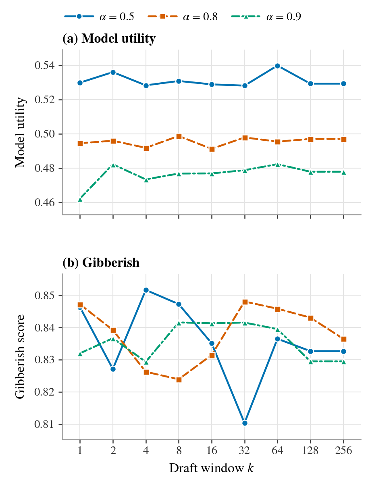
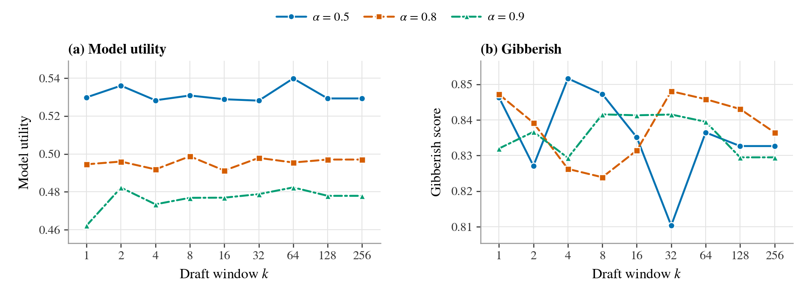
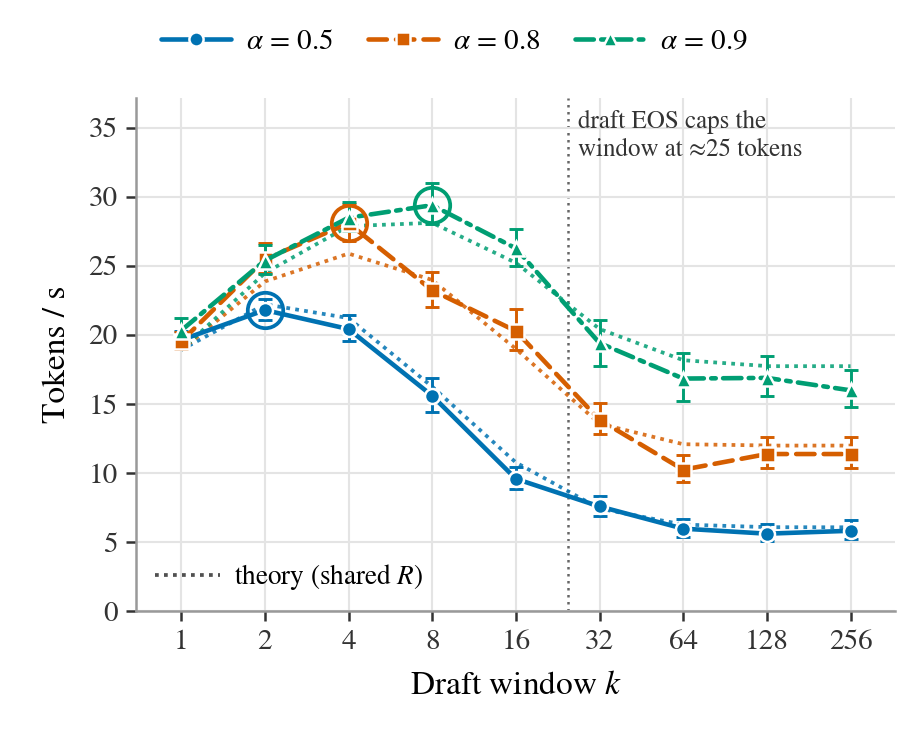

# k-sweep figures for SUD (SimNPO draft) — model utility and gibberish (invariance) and throughput vs the draft window k

_Generated 2026-09-09T14:07 by `plots/make_figure.py --method SimNPO`. Everything for these figures lives in `plots/`._

**Figure 1 — invariance** (`fig_k_invariance_SimNPO.pdf`, one ACL column; `fig_k_invariance_wide_SimNPO.pdf`, full text width):

**Figure 2 — throughput** (`fig_k_throughput_SimNPO.pdf`, one ACL column):

## Suggested captions

**Figure 1. The draft window k does not change SUD's output.** TOFU forget10, target p = Llama-3.2-1B-Instruct fine-tuned on TOFU, draft q = its SimNPO-unlearned checkpoint, seed 0 at every k. (a) Model utility and (b) gibberish score (classifier P(clean) of the forget answers; higher = fewer gibberish answers) are flat in k for every α: SUD samples each token exactly from π ∝ p^(1−α) q^α by draft-verify speculative sampling with no bonus token, so k only sets how many tokens are proposed per round. 

**Figure 2. What k buys in speed.** Throughput of the same cell on 100 forget prompts (batch 1, no KV cache; error bars: bootstrap 95% CI over prompts; rings mark each α's fastest k). Dotted: T(k) = R(1−a^k̃)/((1−a)(k̃+1)) with one shared forward rate R, per-α acceptance a, and k̃ the measured mean drafted tokens per round, which saturates once the draft reaches its own end-of-sequence before k. Best measured speed-up over k = 1: 1.45× at α = 0.9, k = 8.

## Status

- Panels (a)/(b) eval runs: **27/27** sweep points (seed 0) under `plots/results/original-unlearned/target-Llama-3.2-1B-Instruct/draft-Llama-3.2-1B-Instruct_SimNPO/`; 0/9 extra k=1 seed runs (seeds [1, 2, 3]) available as the noise yardstick.
- Figure 2 benchmark cells: **27/27** from `plots/bench/spec_bench_SimNPO.json` (`TOFU_EVAL.json` prompts, n=100, max_new_tokens=200, GPU: NVIDIA RTX A6000)
- Reference lines (target / draft / retain): **not drawn** (default; pass `--with-baselines` to add them); values from `plots/baselines_SimNPO.json` (target p (original), retain model, draft q (SimNPO)).

## Conference styling (EMNLP / ACL)

- Sizes: `fig_k_invariance_SimNPO.pdf` is one ACL column (3.03 in) with (a) above (b) on a shared k-axis, `fig_k_invariance_wide_SimNPO.pdf` the full text width (6.3 in) side by side; `fig_k_throughput_SimNPO.pdf` is one column. Text 7–8 pt at print size.
- Colour: Okabe–Ito colour-blind-safe palette (blue #0072B2, vermillion #D55E00, bluish green #009E73). Every α also has its own dash pattern (solid / dashed / dash-dot) and marker (circle / square / triangle), so the series stay apart under any colour-vision deficiency and in greyscale print; the theory is dotted; optional reference lines are grey-scale with distinct patterns.
- Fonts: STIX / Times-like serif to match the ACL body text; embedded as TrueType (`pdf.fonttype = 42`), never Type 3, so the PDF passes ACL's pubcheck. No subtitles inside the figure — see the suggested caption.

## Setup

- Cell: target p = `open-unlearning/tofu_Llama-3.2-1B-Instruct_full`, draft q = `saves/unlearn/baselines/tofu/SimNPO/Llama-3.2-1B-Instruct/forget10` (SimNPO), TOFU forget10 eval suite.
- SUD decodes from π = softmax((1−α)·log p + α·log q) by draft-verify speculative sampling (`src/model/sud.py`): the draft proposes up to k tokens from q, one target forward verifies them, each is accepted w.p. min(1, π/q), the first rejection is replaced by a residual sample and ends the round. No bonus token (it would follow p and leak forget content). k therefore never changes the sampled distribution — Figure 1 is the empirical check; Figure 2 is what k buys in speed.
- Grid: α ∈ {0.5, 0.8, 0.9} × k ∈ {1, 2, 4, 8, 16, 32, 64, 128, 256}, seed 0. Noise yardstick: seeds [0, 1, 2, 3] at k = 1 (SD reported, no band drawn).
- The eval generates at most 200 new tokens, so a window k > 200 is clipped to the remaining budget each round; and the draft stops proposing at its own EOS, so for k beyond the draft's typical answer length (~35 tokens) the effective window no longer grows with k — k = 64, 128, 256 are then near-identical procedures (only the random draws differ).
- Figure 2: 100 prompts = the first 100 `forget_Q_A_ROUGE` inputs of a Part-1 TOFU_EVAL.json, rebuilt token-for-token through the eval's own dataset/collator path and asserted to decode to the stored `input` strings; batch size 1; eval generation config (max_new_tokens = 200, temperature 1); wall-clock around `generate`, CUDA-synchronised; no KV cache (the prototype re-runs full forwards). Error bars: bootstrap 95% CI (4000 resamples of the prompt set, ratio of total tokens to total seconds).

## Reference values (panels a/b) — not drawn by default; `--with-baselines` adds them

| line | model | role | model_utility | forget_Q_A_gibberish | gibberish source |
|---|---|---|---|---|---|
| target p (original) | `open-unlearning/tofu_Llama-3.2-1B-Instruct_full` | alpha = 0 limit | 0.5992 | 0.8606 | recomputed from stored forget_Q_A_ROUGE generations |
| retain model | `open-unlearning/tofu_Llama-3.2-1B-Instruct_retain90` | TOFU gold reference (retrained without forget10) | 0.5911 | 0.9043 | recomputed from stored forget_Q_A_ROUGE generations |
| draft q (SimNPO) | `saves/unlearn/baselines/tofu/SimNPO/Llama-3.2-1B-Instruct/forget10` | alpha = 1 limit | 0.4939 | 0.9089 | recomputed from stored forget_Q_A_ROUGE generations (stored 0.9089, abs diff 0.0000) |

- These are the standard **greedy-decoded** evals (`do_sample: false`) on byte-identical prompts; SUD always samples at T = 1, which by itself costs about 0.015 model_utility relative to greedy decoding (measured on the main grid as the median generate-minus-forward gap: +0.022 sampled vs +0.037 greedy). Read the SUD-vs-reference gap with that in mind; the k-invariance claim does not depend on it. Where the metric was not stored (target, retain) it was recomputed from the stored generations with the exact metric config; the draft's recomputation reproduces its stored value (see the abs diff column).

## Panel (a) — model_utility across k

| α | k=1 | k=2 | k=4 | k=8 | k=16 | k=32 | k=64 | k=128 | k=256 |
|---|---|---|---|---|---|---|---|---|---|
| 0.5 | 0.5298 | 0.5360 | 0.5283 | 0.5308 | 0.5289 | 0.5281 | 0.5398 | 0.5293 | 0.5293 |
| 0.8 | 0.4945 | 0.4960 | 0.4918 | 0.4987 | 0.4912 | 0.4979 | 0.4955 | 0.4970 | 0.4970 |
| 0.9 | 0.4622 | 0.4822 | 0.4734 | 0.4768 | 0.4769 | 0.4788 | 0.4823 | 0.4779 | 0.4779 |

| α | max abs Δ vs k=1 | range over k | slope / doubling of k | seeds at k=1 | seed SD (k=1) | max abs z vs seeds |
|---|---|---|---|---|---|---|
| 0.5 | 0.0100 | 0.0117 | -0.00004 | 1 | — | — |
| 0.8 | 0.0042 | 0.0075 | +0.00033 | 1 | — | — |
| 0.9 | 0.0201 | 0.0201 | +0.00116 | 1 | — | — |

- Reference values (greedy-decoded standard evals, same prompts; not drawn by default): target p (original) = 0.5992, retain model = 0.5911, draft q (SimNPO) = 0.4939.

## Panel (b) — forget_Q_A_gibberish across k

| α | k=1 | k=2 | k=4 | k=8 | k=16 | k=32 | k=64 | k=128 | k=256 |
|---|---|---|---|---|---|---|---|---|---|
| 0.5 | 0.8463 | 0.8271 | 0.8516 | 0.8472 | 0.8351 | 0.8103 | 0.8365 | 0.8327 | 0.8327 |
| 0.8 | 0.8472 | 0.8392 | 0.8262 | 0.8239 | 0.8314 | 0.8480 | 0.8458 | 0.8430 | 0.8365 |
| 0.9 | 0.8320 | 0.8366 | 0.8293 | 0.8415 | 0.8413 | 0.8415 | 0.8395 | 0.8295 | 0.8295 |

| α | max abs Δ vs k=1 | range over k | slope / doubling of k | seeds at k=1 | seed SD (k=1) | max abs z vs seeds |
|---|---|---|---|---|---|---|
| 0.5 | 0.0360 | 0.0413 | -0.00175 | 1 | — | — |
| 0.8 | 0.0233 | 0.0241 | +0.00053 | 1 | — | — |
| 0.9 | 0.0096 | 0.0122 | -0.00019 | 1 | — | — |

- Reference values (greedy-decoded standard evals, same prompts; not drawn by default): target p (original) = 0.8606, retain model = 0.9043, draft q (SimNPO) = 0.9089.

## Figure 2 — throughput, acceptance, forward rate, VRAM vs k

**Tokens / s** (measured; bootstrap 95% CI over prompts):

| α | k=1 | k=2 | k=4 | k=8 | k=16 | k=32 | k=64 | k=128 | k=256 |
|---|---|---|---|---|---|---|---|---|---|
| 0.5 | 19.62 [19.1, 20.3] | 21.79 [21.1, 22.6] | 20.42 [19.5, 21.5] | 15.59 [14.4, 16.9] | 9.58 [8.9, 10.4] | 7.58 [6.9, 8.3] | 5.98 [5.4, 6.7] | 5.61 [5.1, 6.3] | 5.82 [5.2, 6.6] |
| 0.8 | 19.53 [19.0, 20.2] | 25.47 [24.4, 26.6] | 28.08 [26.8, 29.5] | 23.22 [22.0, 24.5] | 20.27 [18.9, 21.8] | 13.85 [12.9, 15.0] | 10.24 [9.4, 11.3] | 11.38 [10.3, 12.6] | 11.38 [10.3, 12.6] |
| 0.9 | 20.31 [19.5, 21.2] | 25.37 [24.4, 26.5] | 28.47 [27.5, 29.6] | 29.38 [28.0, 31.0] | 26.26 [25.0, 27.7] | 19.41 [17.8, 21.1] | 16.84 [15.2, 18.7] | 16.89 [15.6, 18.5] | 15.98 [14.7, 17.5] |

**Speed-up vs k = 1** — measured wall-clock ratio, and in parentheses the exact algorithmic ratio 2 / (forwards per committed token), which is free of timing noise:

| α | k=1 | k=2 | k=4 | k=8 | k=16 | k=32 | k=64 | k=128 | k=256 | k* (meas.) | best (meas.) | k* (theory) | theory ceiling |
|---|---|---|---|---|---|---|---|---|---|---|---|---|---|
| 0.5 | 1.00× (1.00×) | 1.11× (1.17×) | 1.04× (1.09×) | 0.79× (0.82×) | 0.49× (0.54×) | 0.39× (0.39×) | 0.30× (0.34×) | 0.29× (0.32×) | 0.30× (0.31×) | 2 | 1.11× | 2 | 1.17× |
| 0.8 | 1.00× (1.00×) | 1.30× (1.27×) | 1.44× (1.36×) | 1.19× (1.23×) | 1.04× (1.01×) | 0.71× (0.74×) | 0.52× (0.61×) | 0.58× (0.62×) | 0.58× (0.62×) | 4 | 1.44× | 4 | 1.37× |
| 0.9 | 1.00× (1.00×) | 1.25× (1.29×) | 1.40× (1.49×) | 1.45× (1.52×) | 1.29× (1.37×) | 0.96× (1.04×) | 0.83× (0.92×) | 0.83× (0.88×) | 0.79× (0.88×) | 8 | 1.45× | 8 | 1.49× |

- **Best measured speed-up: 1.45× at (α = 0.9, k\* = 8)**. The ceiling for no-bonus speculative sampling with an equal-size draft is 2× over k = 1 (T(1) = R/2, sup_k T = R as a → 1).

**Theory** T(k) = R / F(k), F = predicted forwards per committed token = Σ_rounds (k_i+1) / Σ_rounds (1−a^k_i)/(1−a), i.e. the round-length DISTRIBUTION, not its mean (k_i ≤ k: the draft stops at its own EOS and at the generation budget; once rounds are heterogeneous, the closed form at the mean k̃ overstates throughput because long rounds burn forwards linearly while their accepted tokens saturate at 1/(1−a)). One shared R = median forwards/s over all cells (37.8 forwards/s; per-cell range 33.5–41.4, spread 21%); a = pooled acceptance per α. Round lengths per cell from: **rounds** = exact per-round histogram (`draft_len_hist`). Tokens/s, measured / theory:

| α | k=1 | k=2 | k=4 | k=8 | k=16 | k=32 | k=64 | k=128 | k=256 | a | k̃ at largest k |
|---|---|---|---|---|---|---|---|---|---|---|---|
| 0.5 | 19.6 / 18.9 | 21.8 / 22.2 | 20.4 / 21.2 | 15.6 / 16.3 | 9.6 / 10.8 | 7.6 / 7.4 | 6.0 / 6.3 | 5.6 / 6.1 | 5.8 / 6.1 | 0.766 | 23.5 (k=256) |
| 0.8 | 19.5 / 18.9 | 25.5 / 23.9 | 28.1 / 25.9 | 23.2 / 24.0 | 20.3 / 19.0 | 13.8 / 13.6 | 10.2 / 12.1 | 11.4 / 12.0 | 11.4 / 12.0 | 0.899 | 23.8 (k=256) |
| 0.9 | 20.3 / 18.9 | 25.4 / 24.5 | 28.5 / 27.9 | 29.4 / 28.1 | 26.3 / 25.2 | 19.4 / 20.4 | 16.8 / 18.2 | 16.9 / 17.7 | 16.0 / 17.7 | 0.949 | 26.8 (k=256) |

- Theory vs measurement: mean abs relative error 5.7%, max 18.0% over 27 cells (the closed form at the mean k̃ would give 11.0% / 36.0%). Nothing is fitted: R is shared and a is the pooled acceptance, so the residual is hardware-rate fluctuation plus whatever round-length heterogeneity the available per-cell data cannot resolve (see the source note above).

  Signed relative error (theory − measured) / measured, per cell:

| α | k=1 | k=2 | k=4 | k=8 | k=16 | k=32 | k=64 | k=128 | k=256 |
|---|---|---|---|---|---|---|---|---|---|
| 0.5 | -3.6% | +1.9% | +3.9% | +4.2% | +12.3% | -2.0% | +4.9% | +8.4% | +4.3% |
| 0.8 | -3.1% | -6.3% | -7.8% | +3.2% | -6.3% | -2.0% | +18.0% | +5.4% | +5.4% |
| 0.9 | -6.9% | -3.5% | -2.1% | -4.3% | -4.0% | +5.2% | +7.9% | +5.0% | +10.9% |

**Forward rate** (forwards / s = (proposed + rounds) / seconds; the hardware constant the theory assumes — should be flat in k and α):

| α | k=1 | k=2 | k=4 | k=8 | k=16 | k=32 | k=64 | k=128 | k=256 |
|---|---|---|---|---|---|---|---|---|---|
| 0.5 | 39.2 | 37.3 | 37.4 | 38.2 | 35.5 | 38.6 | 35.4 | 35.3 | 37.3 |
| 0.8 | 39.1 | 40.1 | 41.4 | 37.8 | 40.0 | 37.4 | 33.5 | 36.9 | 36.9 |
| 0.9 | 40.6 | 39.3 | 38.3 | 38.7 | 38.3 | 37.2 | 36.8 | 38.2 | 36.1 |

**Forwards per committed token** (exact, from the counters; 2 at k = 1 by construction):

| α | k=1 | k=2 | k=4 | k=8 | k=16 | k=32 | k=64 | k=128 | k=256 |
|---|---|---|---|---|---|---|---|---|---|
| 0.5 | 2.000 | 1.713 | 1.830 | 2.452 | 3.708 | 5.093 | 5.929 | 6.280 | 6.404 |
| 0.8 | 2.000 | 1.574 | 1.476 | 1.629 | 1.975 | 2.700 | 3.272 | 3.242 | 3.242 |
| 0.9 | 2.000 | 1.550 | 1.346 | 1.316 | 1.459 | 1.919 | 2.184 | 2.260 | 2.260 |

**Mean drafted tokens per round k̃** (= proposed / rounds ≤ k; saturates once the draft reaches its EOS before k):

| α | k=1 | k=2 | k=4 | k=8 | k=16 | k=32 | k=64 | k=128 | k=256 |
|---|---|---|---|---|---|---|---|---|---|
| 0.5 | 1.0 | 2.0 | 3.9 | 7.3 | 12.5 | 18.9 | 22.8 | 23.4 | 23.5 |
| 0.8 | 1.0 | 2.0 | 3.9 | 7.3 | 13.0 | 21.0 | 23.7 | 23.8 | 23.8 |
| 0.9 | 1.0 | 2.0 | 3.9 | 7.3 | 13.3 | 21.6 | 26.6 | 26.8 | 26.8 |

Fraction of rounds whose draft stopped before k (EOS or budget):

| α | k=1 | k=2 | k=4 | k=8 | k=16 | k=32 | k=64 | k=128 | k=256 |
|---|---|---|---|---|---|---|---|---|---|
| 0.5 | 0.00 | 0.02 | 0.07 | 0.18 | 0.42 | 0.75 | 0.99 | 1.00 | 1.00 |
| 0.8 | 0.00 | 0.02 | 0.07 | 0.18 | 0.38 | 0.68 | 0.98 | 1.00 | 1.00 |
| 0.9 | 0.00 | 0.03 | 0.07 | 0.17 | 0.36 | 0.62 | 0.99 | 1.00 | 1.00 |

**Acceptance a = accepted / verified** (the per-token acceptance probability; should be constant in k):

| α | k=1 | k=2 | k=4 | k=8 | k=16 | k=32 | k=64 | k=128 | k=256 | pooled | max−min |
|---|---|---|---|---|---|---|---|---|---|---|---|
| 0.5 | 0.764 | 0.767 | 0.767 | 0.759 | 0.756 | 0.770 | 0.776 | 0.769 | 0.765 | 0.766 | 0.020 |
| 0.8 | 0.903 | 0.907 | 0.898 | 0.892 | 0.902 | 0.903 | 0.894 | 0.895 | 0.895 | 0.899 | 0.016 |
| 0.9 | 0.948 | 0.945 | 0.955 | 0.955 | 0.953 | 0.947 | 0.948 | 0.944 | 0.944 | 0.949 | 0.011 |

- Acceptance is approximately constant in k (within sampling noise): largest max−min over k = 0.020 at α=0.5, vs a per-cell binomial SE of ≈0.007.

Accepted / *proposed* (the literal counter ratio; proposals after the first rejection are discarded unverified, so it falls with k mechanically — not the process's acceptance rate):

| α | k=1 | k=2 | k=4 | k=8 | k=16 | k=32 | k=64 | k=128 | k=256 |
|---|---|---|---|---|---|---|---|---|---|
| 0.5 | 0.764 | 0.674 | 0.527 | 0.352 | 0.220 | 0.159 | 0.137 | 0.128 | 0.124 |
| 0.8 | 0.903 | 0.868 | 0.766 | 0.622 | 0.491 | 0.350 | 0.285 | 0.288 | 0.288 |
| 0.9 | 0.948 | 0.919 | 0.893 | 0.824 | 0.702 | 0.516 | 0.450 | 0.433 | 0.433 |

**Peak VRAM** (`torch.cuda.max_memory_allocated`, MiB; both models resident):

| α | k=1 | k=2 | k=4 | k=8 | k=16 | k=32 | k=64 | k=128 | k=256 | max−min | rel. |
|---|---|---|---|---|---|---|---|---|---|---|---|
| 0.5 | 4971 | 4981 | 4939 | 4969 | 4974 | 5026 | 5125 | 5509 | 5645 | 706 | 13.8% |
| 0.8 | 4987 | 4950 | 4970 | 4959 | 4952 | 5131 | 5113 | 5155 | 5156 | 206 | 4.1% |
| 0.9 | 4941 | 4975 | 4997 | 4946 | 4971 | 5000 | 5122 | 5132 | 5132 | 191 | 3.8% |

- VRAM is NOT flat across k (largest relative spread 13.8%); the draft window only adds k̃ extra rows to one verification forward.

## Files

- `run_k_sweep.sh` — copy of `scripts/run_sud_original_unlearned_draft.sh` narrowed to this cell (k outer, α inner; `RESULTS_ROOT` → `plots/results`). Resume-safe: re-run to fill missing cells.
- `bench_speculative.py` — panel (c) benchmark (monkeypatches the unmodified `src/model/sud.py` debugger seam; writes no debug files; `--resume` skips cells already in the JSON).
- `baseline_refs.py` — builds `baselines.json` (reference lines) from the standard evals of the target, draft and retain models.
- `make_figure.py` — both figures (invariance in two sizes, throughput) + `fig_k_sweep_data.csv` + this README; `--with-baselines` adds the reference lines.
- `k_sweep_job.sbatch` — the single SLURM job chaining Part 2 (bench) → Part 1 (evals) → Part 3 (figure); draws the figure from whatever exists if the time limit approaches; re-submit it to resume.
- `results/` — the eval run dirs; `bench/spec_bench.json` — one record per (α, k) with per-prompt detail; `logs/`.

Rebuild the figure: `conda run -n unlearning python plots/make_figure.py --method SimNPO`
