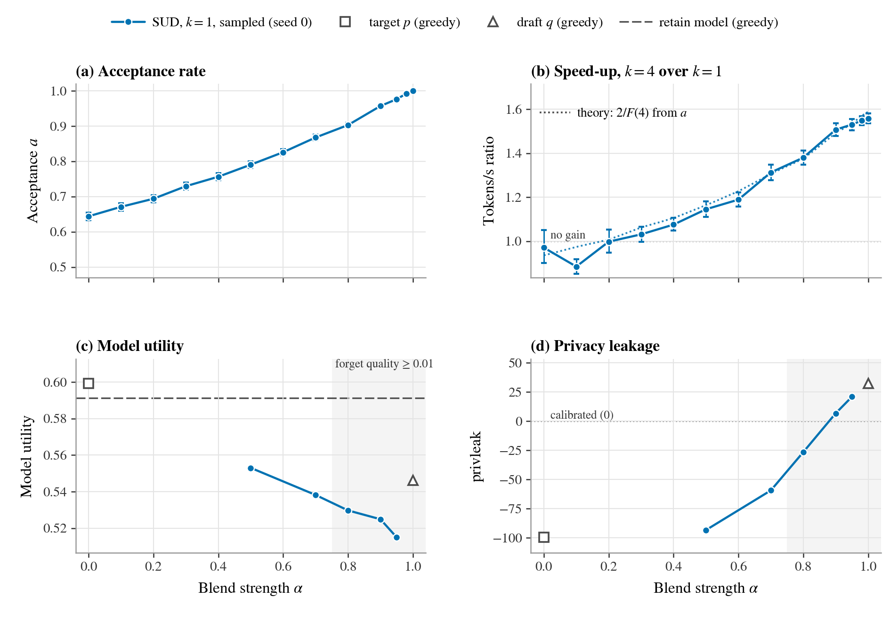

# alpha-tradeoff figure for SUD (NPO draft) — speed and unlearning vs the blend strength α

_Generated 2026-09-09T14:07 by `plots/make_alpha_figure.py --method NPO`._

## Suggested caption

**Figure. Stronger unlearning is faster unlearning.** TOFU forget10, target p = Llama-3.2-1B-Instruct fine-tuned on TOFU, draft q = its NPO-unlearned checkpoint. (a) Per-token acceptance a = P(accept) of draft-verify sampling from π ∝ p^(1−α) q^α, pooled over the k = 1 and k = 4 benchmark cells (100 forget prompts, batch 1, no KV cache; bars: 95% binomial). (b) Measured throughput of k = 4 relative to k = 1 (paired bootstrap 95% CI over prompts); dotted: 2/F(4) with F the predicted forwards per committed token from a and the round-length histogram, so speed is a function of a alone. (c) Model utility and (d) privacy leakage of the same α at k = 1 (seed 0, sampled at T = 1); the grey band marks α with forget quality ≥ 0.01. Hollow grey markers: the standard greedy evals of the target (α = 0) and draft (α = 1); dashed: the retain model. Pushing π toward q raises a, so the α that calibrates leakage also decodes fastest (best 1.56× at α = 1).

## Status

- Benchmark cells: 13/13 α with both k = 1 and k = 4 (13 with acceptance) from `plots/bench/alpha_bench.json` (GPU: NVIDIA RTX A6000, n = 100 prompts, max_new_tokens = 200)
- Unlearning metrics: 5/13 α at k = 1, seed 0 — sources: α=0.5: main grid, α=0.7: main grid, α=0.8: main grid, α=0.9: main grid, α=0.95: main grid
- Greedy reference evals: target (0.5992 utility, -99.5 privleak), draft (0.5463 utility, 32.2 privleak), retain (0.5911 utility, 23.5 privleak)

## Per-α table

| α | a | tok/s k=1 | tok/s k=4 | speed-up [95% CI] | algo. speed-up | theory | utility | forget quality | privleak | metrics from |
|---|---|---|---|---|---|---|---|---|---|---|
| 0 | 0.644 | 15.0 | 14.6 | 0.97× [0.90, 1.05] | 0.92× | 0.94× (rounds) | — | — | — | — |
| 0.1 | 0.671 | 17.3 | 15.3 | 0.89× [0.85, 0.92] | 0.96× | 0.97× (rounds) | — | — | — | — |
| 0.2 | 0.694 | 15.8 | 15.8 | 1.00× [0.95, 1.05] | 0.99× | 1.01× (rounds) | — | — | — | — |
| 0.3 | 0.729 | 16.1 | 16.6 | 1.03× [1.00, 1.07] | 1.04× | 1.06× (rounds) | — | — | — | — |
| 0.4 | 0.756 | 16.1 | 17.3 | 1.08× [1.05, 1.11] | 1.09× | 1.11× (rounds) | — | — | — | — |
| 0.5 | 0.791 | 16.1 | 18.5 | 1.15× [1.11, 1.18] | 1.16× | 1.16× (rounds) | 0.5530 | 9.91e-11 | -93.22 | main grid |
| 0.6 | 0.826 | 16.2 | 19.2 | 1.19× [1.16, 1.22] | 1.21× | 1.23× (rounds) | — | — | — | — |
| 0.7 | 0.868 | 16.0 | 21.0 | 1.31× [1.28, 1.35] | 1.33× | 1.31× (rounds) | 0.5382 | 0.000178 | -59.29 | main grid |
| 0.8 | 0.903 | 15.9 | 21.9 | 1.38× [1.35, 1.41] | 1.37× | 1.38× (rounds) | 0.5297 | 0.0126 | -26.51 | main grid |
| 0.9 | 0.957 | 15.9 | 24.0 | 1.51× [1.48, 1.54] | 1.50× | 1.49× (rounds) | 0.5249 | 0.131 | 6.73 | main grid |
| 0.95 | 0.976 | 16.1 | 24.6 | 1.53× [1.50, 1.55] | 1.54× | 1.53× (rounds) | 0.5150 | 0.523 | 20.87 | main grid |
| 0.98 | 0.992 | 16.2 | 25.1 | 1.55× [1.53, 1.57] | 1.57× | 1.57× (rounds) | — | — | — | — |
| 1 | 1.000 | 16.2 | 25.2 | 1.56× [1.54, 1.58] | 1.59× | 1.59× (rounds) | — | — | — | — |

## Notes

- Acceptance is a per-token quantity and does not depend on k; the k = 1 and k = 4 cells are pooled (their separate values are in the CSV).
- "algo. speed-up" is the exact, timing-free ratio of forwards per committed token (k = 1 costs 2 by construction); "theory" predicts it from a alone plus the k = 4 round-length histogram (`rounds` = exact histogram, `prompts` = per-prompt means for older cells).
- The SUD metrics are sampled at T = 1 while the grey references are greedy; sampling alone costs ≈ 0.015 model_utility on this grid, so compare SUD's α = 0 / 1 points (which also sample) with the hollow markers to read the handicap directly.
- forget_quality is the TOFU KS-test p-value (≥ 0.01 = indistinguishable from the retain model); privleak 0 = calibrated to the retain model, negative = under-unlearned (leaks), positive = overshoot.

Rebuild: `conda run -n unlearning python plots/make_alpha_figure.py --method NPO`
