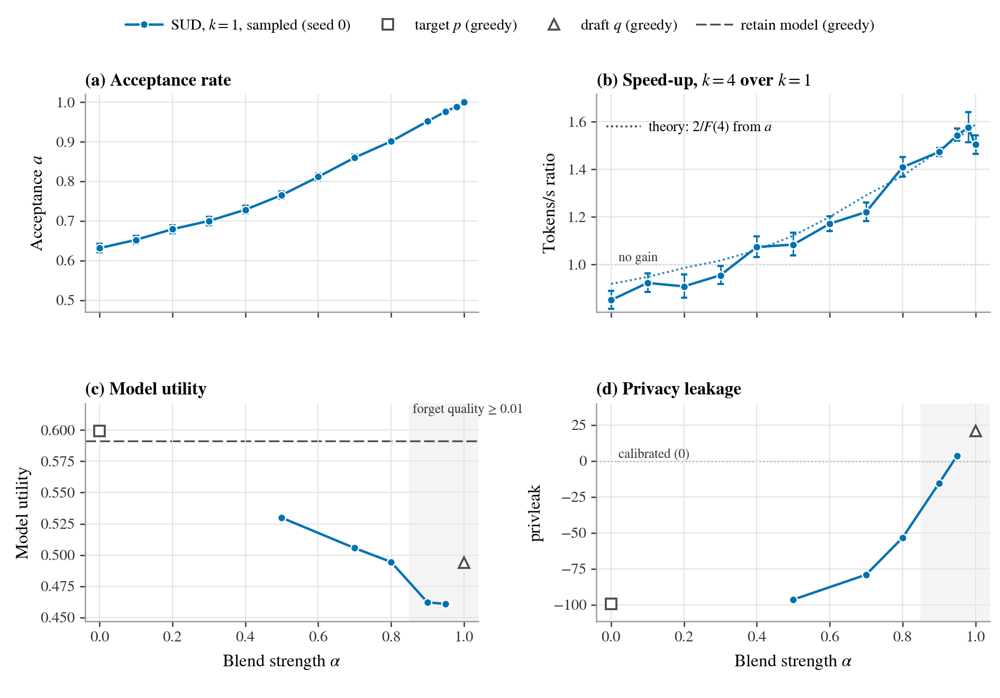

# alpha-tradeoff figure for SUD (SimNPO draft) — speed and unlearning vs the blend strength α

_Generated 2026-09-09T14:07 by `plots/make_alpha_figure.py --method SimNPO`._

## Suggested caption

**Figure. Stronger unlearning is faster unlearning.** TOFU forget10, target p = Llama-3.2-1B-Instruct fine-tuned on TOFU, draft q = its SimNPO-unlearned checkpoint. (a) Per-token acceptance a = P(accept) of draft-verify sampling from π ∝ p^(1−α) q^α, pooled over the k = 1 and k = 4 benchmark cells (100 forget prompts, batch 1, no KV cache; bars: 95% binomial). (b) Measured throughput of k = 4 relative to k = 1 (paired bootstrap 95% CI over prompts); dotted: 2/F(4) with F the predicted forwards per committed token from a and the round-length histogram, so speed is a function of a alone. (c) Model utility and (d) privacy leakage of the same α at k = 1 (seed 0, sampled at T = 1); the grey band marks α with forget quality ≥ 0.01. Hollow grey markers: the standard greedy evals of the target (α = 0) and draft (α = 1); dashed: the retain model. Pushing π toward q raises a, so the α that calibrates leakage also decodes fastest (best 1.58× at α = 0.98).

## Status

- Benchmark cells: 13/13 α with both k = 1 and k = 4 (13 with acceptance) from `plots/bench/alpha_bench_SimNPO.json` (GPU: NVIDIA RTX A6000, n = 100 prompts, max_new_tokens = 200)
- Unlearning metrics: 5/13 α at k = 1, seed 0 — sources: α=0.5: main grid, α=0.7: main grid, α=0.8: main grid, α=0.9: main grid, α=0.95: main grid
- Greedy reference evals: target (0.5992 utility, -99.5 privleak), draft (0.4939 utility, 20.8 privleak), retain (0.5911 utility, 23.5 privleak)

## Per-α table

| α | a | tok/s k=1 | tok/s k=4 | speed-up [95% CI] | algo. speed-up | theory | utility | forget quality | privleak | metrics from |
|---|---|---|---|---|---|---|---|---|---|---|
| 0 | 0.631 | 19.9 | 17.0 | 0.85× [0.81, 0.89] | 0.87× | 0.92× (rounds) | — | — | — | — |
| 0.1 | 0.652 | 19.2 | 17.7 | 0.92× [0.88, 0.96] | 0.91× | 0.95× (rounds) | — | — | — | — |
| 0.2 | 0.679 | 20.0 | 18.1 | 0.91× [0.86, 0.96] | 0.93× | 0.99× (rounds) | — | — | — | — |
| 0.3 | 0.700 | 19.3 | 18.4 | 0.96× [0.92, 0.99] | 0.97× | 1.02× (rounds) | — | — | — | — |
| 0.4 | 0.728 | 19.2 | 20.6 | 1.07× [1.03, 1.12] | 1.03× | 1.06× (rounds) | — | — | — | — |
| 0.5 | 0.765 | 20.0 | 21.7 | 1.08× [1.04, 1.13] | 1.09× | 1.12× (rounds) | 0.5298 | 4.64e-12 | -96.43 | main grid |
| 0.6 | 0.811 | 19.2 | 22.5 | 1.17× [1.14, 1.20] | 1.18× | 1.20× (rounds) | — | — | — | — |
| 0.7 | 0.860 | 20.0 | 24.4 | 1.22× [1.18, 1.26] | 1.28× | 1.29× (rounds) | 0.5056 | 2.13e-06 | -79.10 | main grid |
| 0.8 | 0.901 | 19.3 | 27.2 | 1.41× [1.37, 1.45] | 1.36× | 1.37× (rounds) | 0.4945 | 0.00229 | -53.38 | main grid |
| 0.9 | 0.952 | 19.3 | 28.5 | 1.47× [1.46, 1.49] | 1.49× | 1.48× (rounds) | 0.4622 | 0.0541 | -15.48 | main grid |
| 0.95 | 0.976 | 19.2 | 29.7 | 1.54× [1.52, 1.57] | 1.53× | 1.53× (rounds) | 0.4609 | 0.281 | 3.77 | main grid |
| 0.98 | 0.989 | 19.9 | 31.3 | 1.58× [1.51, 1.64] | 1.56× | 1.56× (rounds) | — | — | — | — |
| 1 | 1.000 | 19.8 | 29.8 | 1.50× [1.46, 1.54] | 1.59× | 1.59× (rounds) | — | — | — | — |

## Notes

- Acceptance is a per-token quantity and does not depend on k; the k = 1 and k = 4 cells are pooled (their separate values are in the CSV).
- "algo. speed-up" is the exact, timing-free ratio of forwards per committed token (k = 1 costs 2 by construction); "theory" predicts it from a alone plus the k = 4 round-length histogram (`rounds` = exact histogram, `prompts` = per-prompt means for older cells).
- The SUD metrics are sampled at T = 1 while the grey references are greedy; sampling alone costs ≈ 0.015 model_utility on this grid, so compare SUD's α = 0 / 1 points (which also sample) with the hollow markers to read the handicap directly.
- forget_quality is the TOFU KS-test p-value (≥ 0.01 = indistinguishable from the retain model); privleak 0 = calibrated to the retain model, negative = under-unlearned (leaks), positive = overshoot.

Rebuild: `conda run -n unlearning python plots/make_alpha_figure.py --method SimNPO`
